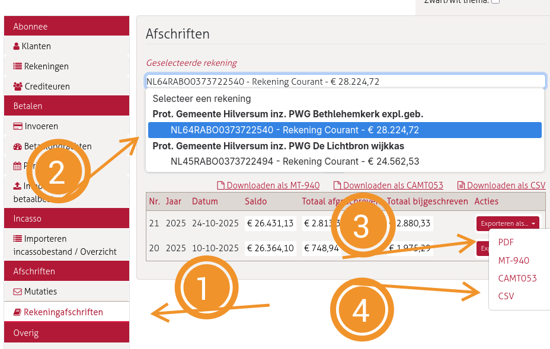
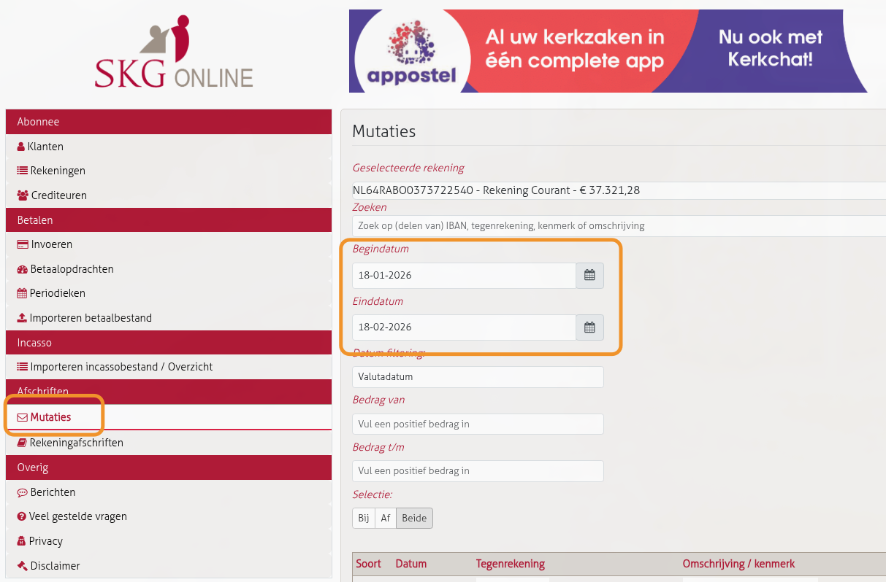
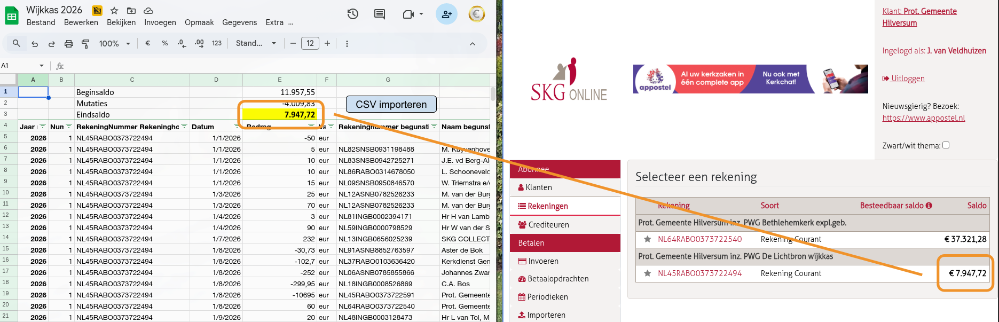
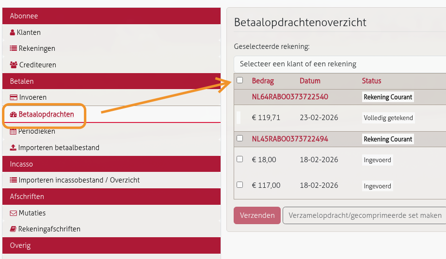

# Wekelijkse taken penningmeester

De penningmeester werkt 1 dag per week. Dit zijn de vaste taken:

## Checklist

1. **Afschriften exporteren** - uit SKG Online exporteren en importeren in Google Sheets
2. **Collectebonnen** - check bestellingen en doorgeven aan Ewout
3. **Mailbox nalopen** - facturen betalen, declaraties verwerken, overige mail beantwoorden of archiveren
4. **Transacties wijkkas controleren** - alles correct? Niets op verkeerde rekening binnengekomen?
5. **Transacties exploitatie verwerken** - betaalde verhuurfacturen verwerken in debiteurenlijst
6. **Betalingen accorderen** - alle ingevoerde betalingen in SKG accorderen (anders gaan ze niet weg)
7. **Coderen** - grootboekcodes toewijzen aan nieuwe boekingen (wijkkas en exploitatie). Mag een week worden overgeslagen.

---

## How-to: Afschriften exporteren

Doe onderstaande stappen **per rekening** (wijkkas en exploitatie).

### Stap 1: Open SKG Online

Ga naar **Afschriften > Rekeningafschriften**.

### Stap 2: Selecteer de rekening

Kies de juiste rekening:
- **PWG Bethlehemkerk expl.geb.** (exploitatie)
- **PWG De Lichtbron wijkkas** (wijkkas)

### Stap 3: Exporteer als PDF

1. Klik op "Exporteren als..." bij het gewenste afschrift
2. Kies PDF
3. Hernoem naar `[type]-JJJJ-XX.pdf` (XX = afschriftnummer):
   - `exploitatie-2026-01.pdf`
   - `wijkkas-2026-01.pdf`
4. Opslaan in Google Drive: `[jaar]/Administratie/[Wijkkas of Exploitatie]/Bankafschriften/`

**Let op:** Het opslaan-scherm toont automatisch de laatst gekozen folder. Controleer dat de juiste map is geselecteerd.

### Stap 4: Exporteer mutaties als CSV

De CSV exporteer je **niet** via Rekeningafschriften, maar via het Mutaties-scherm.

1. Ga naar **Afschriften > Mutaties**

   

2. Kies dezelfde rekening (wijkkas of exploitatie)
3. Het standaard datumbereik (afgelopen maand) mag zo blijven — overlap is oké, het Apps Script dedupliceert
4. Klik onderaan op **"Exporteer als CSV"**
5. De CSV belandt in de Downloads-map. Verplaats en hernoem naar de juiste map met datumnaam:
   `mv Mutatieoverzicht.csv ~/Cloud/penningmeester/2026/[Wijkkas of Exploitatie]/Bankafschriften/20260218.csv`
6. De datumnaam (`JJJJMMDD.csv`) zorgt ervoor dat bestanden in de juiste volgorde worden verwerkt

### Stap 5: Importeer CSV in Google Sheets

De sheets voor Wijkkas en Exploitatie hebben een Apps Script voor het inlezen van CSV's:

1. Open de sheet (Wijkkas of Exploitatie)
2. Klik op de knop **"CSV importeren"**
3. Het script leest automatisch alle CSV-bestanden uit de map Bankafschriften
4. Verwerkte CSV's worden verplaatst naar de submap `Ingelezen CSV's` (om dubbel verwerken te voorkomen)
5. Bij meerdere CSV's worden ze in de juiste volgorde verwerkt

### Stap 6: Saldocheck

Controleer na het importeren of het **saldo bovenin de Google Sheet** overeenkomt met het **saldo op de SKG website** (bij "Selecteer een rekening").

---

---

## How-to: Betalingen verhuurfacturen controleren

1. Open de Google Sheet **Debiteuren** en ga naar het tabblad van het huidige jaar
2. Open daarnaast de **exploitatie-sheet** en bekijk de nieuwe mutaties (van nieuw naar oud)
3. Bij een betaling met een factuurnummer in de omschrijving (bijv. `202512-270`):
   - Zoek het factuurnummer op in de Debiteuren sheet
   - Controleer of het bedrag klopt
   - Vul de betaaldatum in
   - Bij afwijkend bedrag: plaats een notitie in de Debiteuren sheet en onderneem zo nodig actie
4. Stop zodra je een betaling tegenkomt die al als betaald gemarkeerd is

**Verdwaalde collectebonbestellingen:** soms komt een collectebonbestelling binnen op de exploitatierekening in plaats van de wijkkas. Afhandeling:

1. Maak een betaalopdracht in SKG van exploitatie naar wijkkas (kruispost)
2. Codeer de ontvangst en overboeking op de exploitatierekening als kruispost
3. Codeer de ontvangst op de wijkkas als code 170 (collectebonnen bestelling)

---

## How-to: Mailbox nalopen

**Account**: penningmeester@lichtbron-hilversum.nl (Gmail)

Doorloop de inbox **van nieuw naar oud**. Zo zie je reacties op eerdere mails eerst.

Per mail beoordelen en afhandelen:

| Type mail | Actie | Gmail-label |
|-----------|-------|-------------|
| Factuur | Factuur opslaan in Drive, betaalopdracht invoeren in SKG | `Betaalde facturen` |
| Declaratie | Betaalopdracht invoeren in SKG (bonnetjes blijven bij de mail) | `Betaalde declaraties` |
| Doorsturen naar PgH | Doorsturen naar financien@pknhilversum.nl | `Door naar PgH` |
| Overig relevant | Archiveren met passend label | per geval (bijv. `Kerktuin`) |
| Irrelevant / spam | Verwijderen | — |
| Informatief / afgehandeld | Archiveren | — |

Zie voor details: `../processen/betalen-facturen.md` en `../processen/declaraties.md`

---

## How-to: Transacties wijkkas controleren

1. Open de Google Sheet **Wijkkas**
2. Bekijk de nieuwe (ongecodeerde) regels — snelle visuele scan
3. Let specifiek op **"Kerkelijke bijdrage"** of **"Kerkbalans"** in de omschrijving:
   - Deze horen niet op de wijkkas maar op de **PgH-rekening**
   - Stort het bedrag door naar PgH
   - Vraag de gever om het voortaan direct naar PgH te storten
4. Overige uitzonderingen komen bij het coderen (stap 7) naar boven

---

## How-to: Betalingen accorderen

1. Ga naar **Betalen > Betaalopdrachten**

   

2. Het overzicht toont alle opdrachten per rekening met status:
   - **Ingevoerd** — moet nog geaccordeerd worden
   - **Volledig getekend** — al geaccordeerd, staat klaar voor betaling op de aangegeven datum
3. Klik het **bovenste checkboxje** aan om alle regels te selecteren (beide rekeningen in één keer)
4. Klik op **"Verzenden"**
5. Accordeer met de **digipass** (fysiek apparaat met kleurenraster, vergelijkbaar met Rabo Reader)

---

## How-to: Coderen

Zie `../../processen/bankafschriften-coderen.md` voor het volledige stappenplan.

---

## How-to's (nog uit te werken)

- [ ] How-to: Collectebonnen bestellingen verwerken
	