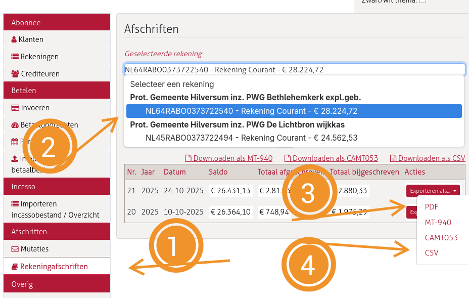
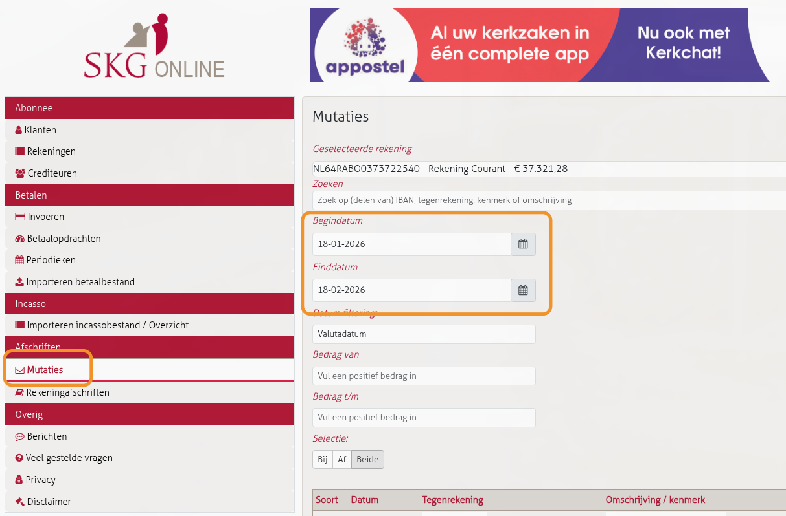
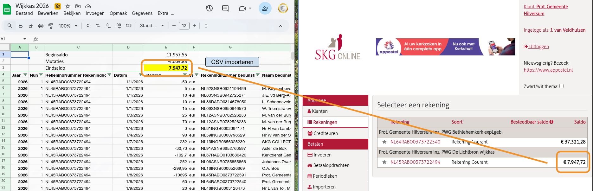

# Bankafschriften importeren

Doe onderstaande stappen **per rekening** (wijkkas en exploitatie).

## Stap 1: Open SKG Online

Ga naar **Afschriften > Rekeningafschriften**.

## Stap 2: Selecteer de rekening

Kies de juiste rekening:
- **PWG Bethlehemkerk expl.geb.** (exploitatie)
- **PWG De Lichtbron wijkkas** (wijkkas)

## Stap 3: Exporteer als PDF

1. Klik op "Exporteren als..." bij het gewenste afschrift
2. Kies PDF
3. Hernoem naar `[type]-JJJJ-XX.pdf` (XX = afschriftnummer):
   - `exploitatie-2026-01.pdf`
   - `wijkkas-2026-01.pdf`
4. Opslaan in Google Drive: `[jaar]/Administratie/[Wijkkas of Exploitatie]/Bankafschriften/`

**Let op:** Het opslaan-scherm toont automatisch de laatst gekozen folder. Controleer dat de juiste map is geselecteerd.

## Stap 4: Exporteer mutaties als CSV

De CSV exporteer je **niet** via Rekeningafschriften, maar via het Mutaties-scherm.

1. Ga naar **Afschriften > Mutaties**

   

2. Kies dezelfde rekening (wijkkas of exploitatie)
3. Het standaard datumbereik (afgelopen maand) mag zo blijven — overlap is oké, het Apps Script dedupliceert
4. Klik onderaan op **"Exporteer als CSV"**
5. De CSV belandt in de Downloads-map. Verplaats en hernoem naar de juiste map met datumnaam:
   `mv Mutatieoverzicht.csv ~/Cloud/penningmeester/2026/[Wijkkas of Exploitatie]/Bankafschriften/20260218.csv`
6. De datumnaam (`JJJJMMDD.csv`) zorgt ervoor dat bestanden in de juiste volgorde worden verwerkt
7. NOTA BENE: zorg dat er gesynchroniseerd wordt van lokaal naar de cloud

## Stap 5: Importeer CSV in Google Sheets

De sheets voor Wijkkas en Exploitatie hebben een Apps Script voor het inlezen van CSV's:

1. Open de sheet (Wijkkas of Exploitatie)
2. Klik op de knop **"CSV importeren"**
3. Het script leest automatisch alle CSV-bestanden uit de map Bankafschriften
4. Verwerkte CSV's worden verplaatst naar de submap `Ingelezen CSV's` (om dubbel verwerken te voorkomen)
5. Bij meerdere CSV's worden ze in de juiste volgorde verwerkt

## Stap 6: Saldocheck

Controleer na het importeren of het **saldo bovenin de Google Sheet** overeenkomt met het **saldo op de SKG website** (bij "Selecteer een rekening").

