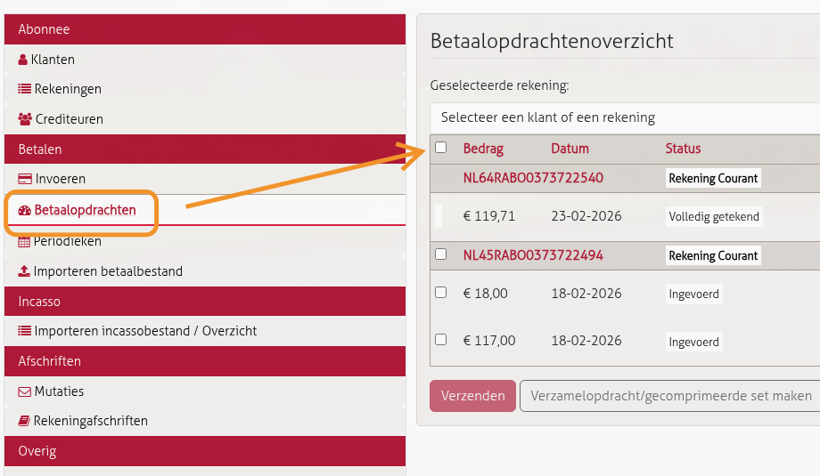

# Betalingen accorderen

1. Ga naar **Betalen > Betaalopdrachten**

   

2. Het overzicht toont alle opdrachten per rekening met status:
   - **Ingevoerd** — moet nog geaccordeerd worden
   - **Volledig getekend** — al geaccordeerd, staat klaar voor betaling op de aangegeven datum
3. Klik het **bovenste checkboxje** aan om alle regels te selecteren (beide rekeningen in een keer)
4. Klik op **"Verzenden"**
5. Accordeer met de **digipass** (fysiek apparaat met kleurenraster, vergelijkbaar met Rabo Reader)
