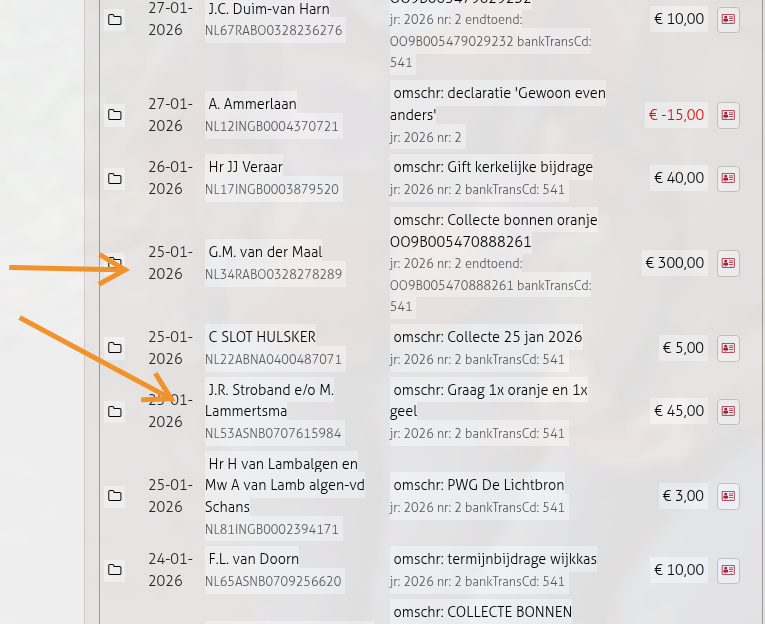
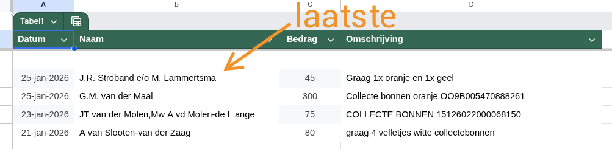

# Collectebonnen

## Proces

1. **Bestellingen binnenkomen**: Wekelijks komen bestellingen binnen op de rekening van de Wijkkas
2. **Doorgeven aan Ewout**: De penningmeester zet de bestellingen in een mailtje naar Ewout Limburg
3. **Distributie**: Ewout zorgt ervoor dat de bestellers hun bonnen krijgen

## Contactpersoon

- **Ewout Limburg** - verantwoordelijk voor de distributie van collectebonnen

## Wekelijkse check

1. Check de mutaties op de wijkkas-rekening
   - Zoek naar bestellingen in de omschrijvingen (zie voorbeeld hieronder)
   - 
2. In de omschrijving staat welke bonnen besteld zijn (oranje, wit)
   - 
3. Verzamel bestellingen van nieuw naar oud totdat je bij een al doorgegeven bestelling komt
4. Geef naam, bestelling en bedrag door aan Ewout Limburg
5. Gebruik Sheet 'Collectebonnen' (in privé account) voor copy-paste in de mail
   - In deze sheet kun je zien welke de laatste was
6. Als er geen nieuwe bestellingen zijn: dit ook doorgeven aan Ewout

## Bestelling op verkeerde rekening

Als een bestelling per ongeluk op de Exploitatie-rekening binnenkomt:

1. Bestelling gewoon doorgeven aan Ewout
2. Bedrag doorstorten naar de Wijkkas
3. Boeken als kruispost in de boekhouding

## Afdracht

- Tegen het einde van het boekjaar vraagt **Theo van Doorn** (kerkelijk bureau) per mail om een bepaald bedrag over te schrijven naar PgH
- Theo berekent het af te dragen bedrag

## Boekhouding

- **Code 170**: Bestelling van collectebonnen (inkomsten op wijkkas)
- **Code 171**: Afdracht naar PgH (einde boekjaar)
