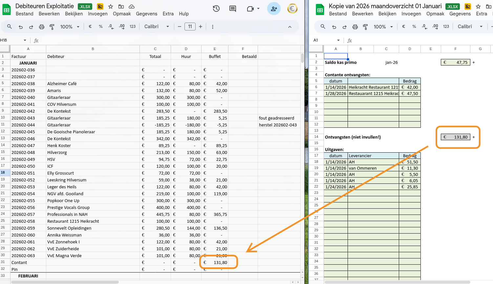

# Verhuur-facturatieproces

Maandelijks proces voor het verwerken van verhuur, consumpties en bijbehorende facturatie.

## Trigger

De koster geeft begin van de maand een seintje dat de administratie van de vorige maand klaar is. Hij legt de map met paperassen (formulieren consumpties, urenformulier hulpkoster) in het postbakje van de penningmeester in de kerk. Zijn spreadsheet wordt automatisch gesynchroniseerd via een cron job (elke nacht om 3:00, one-way sync van Dropbox naar Google Drive map `DropboxKoster`).

## Stap 1: Kopie koster-sheet maken

1. Ga naar Google Drive: `DropboxKoster/Koster Bethlehemkerk/2026/Financieel/`
2. Kopieer de sheet (bijv. `2026 Maandoverzicht 01 januari.xlsx`) naar `2026/Exploitatie/Koster/`
3. Het bestand heet dan `Kopie van 2026 Maandoverzicht 01 januari.xlsx`

De koster-sheet heeft drie tabs:
- **Maandoverzicht** — verhuurdetails per datum, inclusief gitaarlessen (vast terugkerend, bovenaan)
- **Kasafdracht** — contante ontvangsten
- **Vrijwilligers** — uren hulpkoster(s)

## Stap 2: Controles

### Ontbrekende huurprijzen

Soms staat er geen huurprijs in de sheet. Controleer in dat geval de reserveringsbevestiging in `DropboxKoster/Koster Bethlehemkerk/2026/reserveringen/` en neem de afgesproken huurprijs over in de kopie.

### Consumpties

De map met papieren uit het postbakje bevat per verhuur-activiteit een formulier met consumpties. Controleer of de consumpties in de sheet overeenkomen met de formulieren en corrigeer waar nodig.

## Stap 3: Sorteren op huurder

Selecteer de detailregels in de tab Maandoverzicht en sorteer op kolom B (huurder/activiteit). Zo staan alle activiteiten per huurder bij elkaar voor één factuur.

## Stap 4: Factureren via Jortt

Inloggen op [jortt.nl](https://jortt.nl) met penningmeester@delichtbron.nl.

Per huurder één factuur per maand:
1. Kies de debiteur
2. Voeg regels toe per categorie: huur, koffie/thee, kannen koffie/thee, frisdrank, bier, wijn, buffet, etc.
3. Gitaarleraar: alleen huur, geen consumpties
4. Verstuur de factuur per email vanuit Jortt

Jortt geeft factuurnummers het formaat `JJJJMM-XXXX` op basis van de huidige maand. Facturen lopen dus altijd een maand achter op de verhuurmaand (facturen `202604-XXX` = verwerking van maart 2026). Bij de jaarwisseling: facturen `202601-XXX` horen bij december van het vorige jaar.

### Automatisch archiveren

Jortt stuurt een kopiefactuur naar penningmeester@delichtbron.nl. Het AppScript `verwerkFactuurMails()` archiveert de bijlage automatisch naar `2026/Exploitatie/Facturen/` op Google Drive en verwijdert de mail. Dit script handmatig uitvoeren als de facturering klaar is.

## Stap 5: Debiteuren Exploitatie sheet bijwerken

Voeg per factuur een regel toe in de sectie van de juiste maand in tabblad BK2026:
- Factuurnummer
- Huurder
- Bedrag huur
- Bedrag rest (consumpties etc.)
- Kolom betaaldatum: wordt later ingevuld bij de wekelijkse controle

### Contant en pin

- **Contant**: overnemen uit de tab Kasafdracht in de koster-sheet (bedrag "Ontvangsten") — zie 
- **Pin**: maandtotaal opzoeken in de Zettle website

## Stap 6: Vrijwilligersvergoeding

Op basis van het urenformulier in het postbakje: bedrag overmaken naar de hulpkoster(s).

## Stap 7: Overnemen naar journaal

[TODO: Stap overnemen naar journaal nog documenteren. Bedragen uit Debiteuren sheet worden handmatig overgenomen naar het journaal in de Exploitatie sheet.]

## Controle

Onderaan de koster-sheet staan controletotalen. Deze moeten overeenkomen met de maandtotalen onderaan de Debiteuren sheet.

## Bekende problemen

- Soms verschijnt er een popup in Jortt (zie ). De inhoud wordt bewaard, gewoon de pagina refreshen.

## Verbeterpunten

- Debiteuren sheet omzetten van Excel naar Google Sheets
- Oude tabbladen BK2023/BK2024 opruimen (uitzoeken of er nog relevante info instaat)
- Outlook-adres penningmeesterbethlehemkerk@outlook.com opheffen
- Pin-bedrag per maand automatiseren (Zettle mails of stortingen op bank tellen)
- Koster-sheet: kopiëren overbodig maken, eventueel combineren in Exploitatie-sheet
- Koster-sheet: omzetten naar Google Sheets
- Overnemen naar journaal automatiseren
